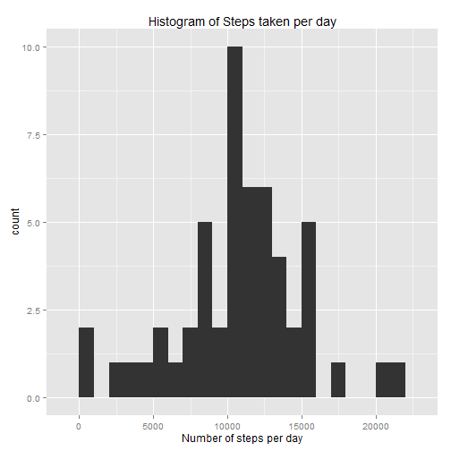
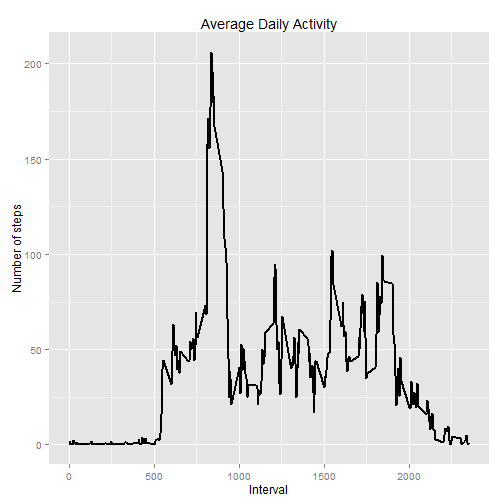
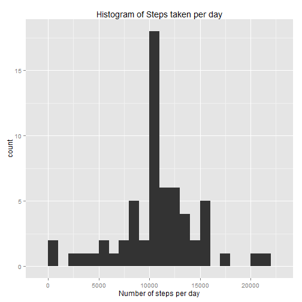

## Loading and preprocessing the data
In this chapter the data is loaded as well as the cleaning of the data.


```r
setwd('C:/Users/Dimitrios/Documents/Dimitris_general/Coursera/Reproducible research')
data <- read.csv('activity.csv')
```

The cleaning of the data in the following code. 


```r
TempInterv <- sub("([[:digit:]]{2,2})$", ":\\1", data$interval)
TempInterv[grepl('^:',TempInterv)] <- paste0('0',TempInterv[grepl('^:',TempInterv)])
TempInterv[nchar(TempInterv)==1] <- paste0('0:0',TempInterv[nchar(TempInterv)==1])
data$date <- paste(data$date,TempInterv,'')
data$date <- strptime(data$date,format='%Y-%m-%d %H:%M')
```

In the above code the interval and date column are compined and transformed to Date format.

## Mean Total Number of steps taken per day

In this part the following actions are done:

* Calculate the total number of steps taken per day
* Make a histogram of the total number of steps taken each day.
* Calculate and report the mean and median of the total number of steps taken per day.


```r
SumStep <- aggregate(data$steps ~ as.Date(data$date),FUN=sum,na.rm=TRUE)
names(SumStep) <- c('date','steps')
```


The histogram follows:

```r
library(ggplot2)
qplot(SumStep$steps,data=SumStep,geom='histogram',binwidth=1000)+
    labs(title='Histogram of Steps taken per day',x='Number of steps per day')
```

 


Mean and median value:


```r
MeanStep <- mean(SumStep$steps)
MedianStep <- median(SumStep$steps)
```

The mean of the total number of steps taken per day is 1.0766189 &times; 10<sup>4</sup>. The median value is 10765.

## Average daily activity pattern

We calculate the aggregation of steps by the five minute interval: 

```r
MeanStep <- aggregate(data$steps ~ data$interval,FUN=mean,na.rm=TRUE)
names(MeanStep) <- c('Interval','steps')
```

and we plot the results using ggplot package:

```r
ggplot(MeanStep,aes(x=Interval,y=steps))+
    geom_line(color='black',size=1)+
    labs(title='Average Daily Activity',y='Number of steps')
```

 


```r
MaxTImeInterval <- MeanStep$Interval[which.max(MeanStep$steps)]
```

The maximum number of steps on average is at 8:35.

## Imputing missing values


```r
TotalNA <- sum(is.na(data$steps))
Percent <- (TotalNA/length(data$steps))*100
```

The total number of missing values is 2304 which correspont to the 13.1147541 % of the Total Data.  

The missing values are replaced with the means of the 5 minute interval that correspont the NA value.


```r
data$steps[is.na(data$steps)] <- MeanStep$steps[match(MeanStep$Interval,data$interval[is.na(data$steps)])]
```
and we check now if there are missing values to be sure:


```r
sum(is.na(data$steps))
```

```
## [1] 0
```

The histogram follows:


```r
SumStep <- aggregate(data$steps ~ as.Date(data$date),FUN=sum,na.rm=TRUE)
names(SumStep) <- c('date','steps')
```


The histogram follows:

```r
library(ggplot2)
qplot(SumStep$steps,data=SumStep,geom='histogram',binwidth=1000)+
    labs(title='Histogram of Steps taken per day',x='Number of steps per day')
```

 

Mean and median value:


```r
MeanStep <- mean(SumStep$steps)
MedianStep <- median(SumStep$steps)
```

The mean of the total number of steps taken per day is 1.0766189 &times; 10<sup>4</sup>. The median value is 1.0766189 &times; 10<sup>4</sup>.It can be observed that the median value changed slightly after filling the NA values. Furthermore, median and mean value are identical.

## Are there differences in activity patterns between weekdays and weekends

We create a new factor variable with two levels: weekday and weekend:


```r
weekdays <- c('Monday', 'Tuesday', 'Wednesday', 'Thursday', 'Friday')
data$DateType <- c('weekend','weekday')[(weekdays(data$date) %in% weekdays)+1L]
data$DateType <- as.factor(data$DateType)
```
We calculate the mean per interval and type of day(weekday or weekend)

```r
MeanData <- aggregate(data$steps,by=list(data$DateType,data$interval),mean)
names(MeanData) <- c('DayType','Interval','steps')
```
A panel plot containing a time series plot of the 5 minute interval and the average number of steps taken, averaged across all weekday days and weekend days is following:


```r
ggplot(MeanData,aes(x=Interval,y=steps))+
    geom_line(color='black',size=1)+
    facet_wrap(~ DayType, nrow=2,ncol=1)+
    labs(x='Interval',y='Number of steps')
```

 


It can be seen above that the activity on the weekdays has the greatest peak from all step intervals. Furthermore, it can be seen that weekends activities has more peaks that exceeds 100 steps compared with the weekdays activities.
